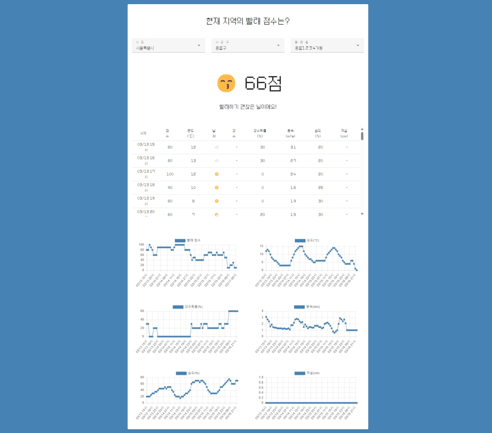
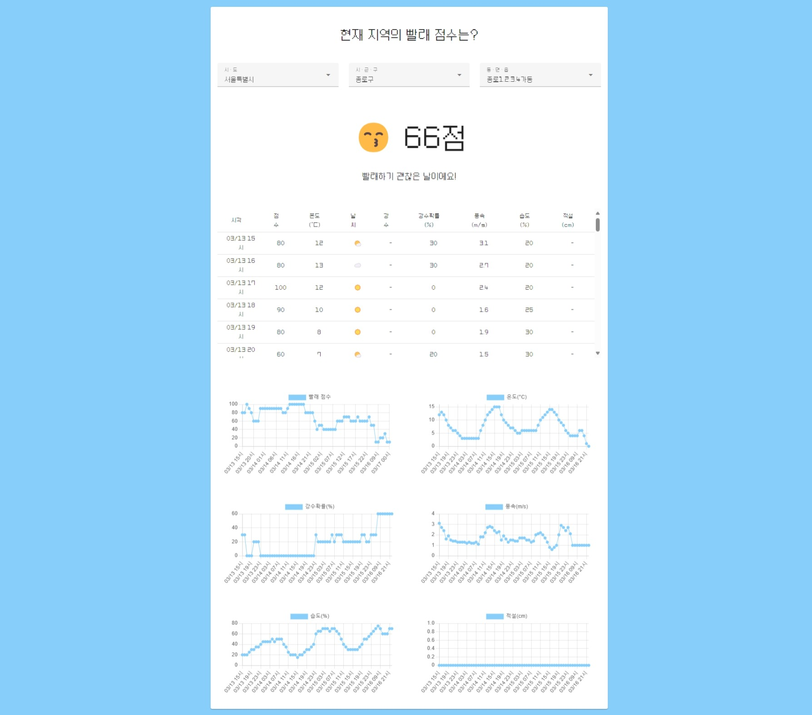
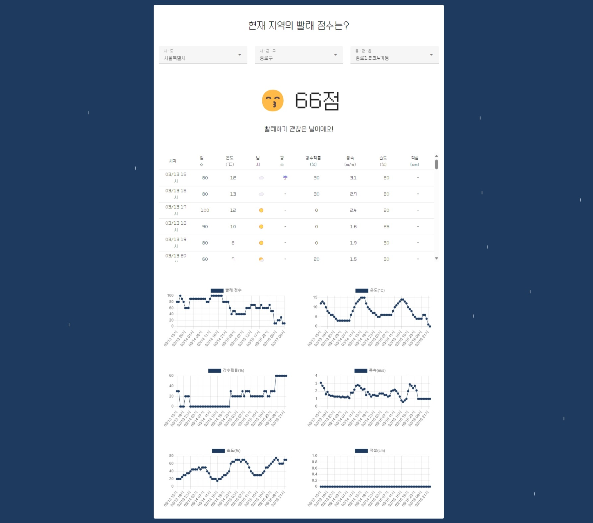
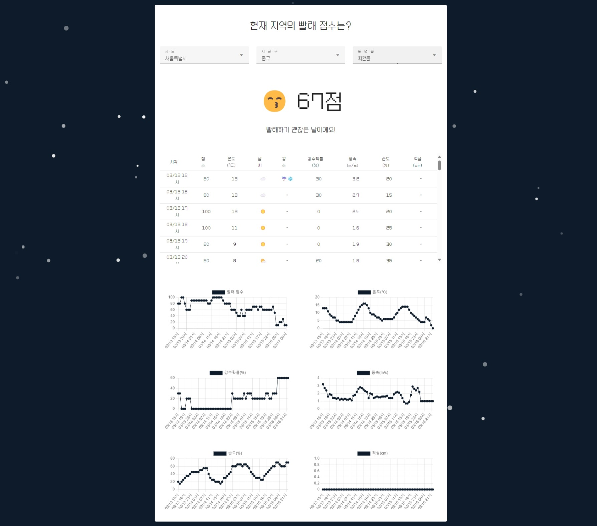
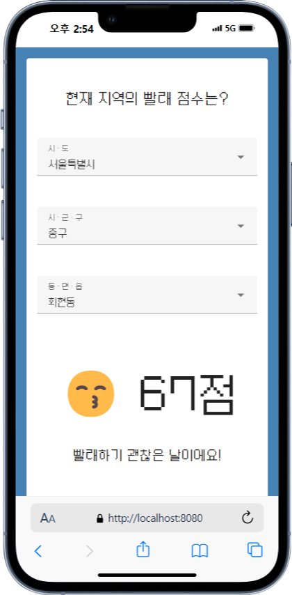
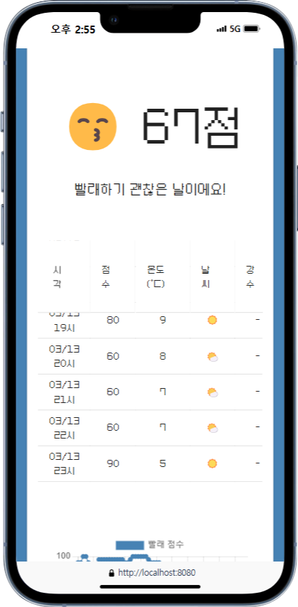
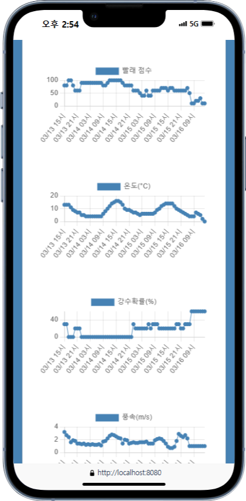

# 📌 Information
### ✨ Introduce
<strong>빨래말래</strong>는 빨래 점수를 알려주는 웹 서비스입니다.  
사용자가 선택한 위치의 3일치 데이터(날씨, 습도, 풍속, 강우량, 적설량 등)를 취합하여 빨래 점수를 판단합니다.  
기상청에서 제공해 주는 오픈 API를 기반으로 개발되었습니다. 
  
<strong>ppllae-mallae</strong> is a web service that tells you your laundry score.  
The laundry score is determined by collecting three days' worth of data (weather, humidity, wind speed, rainfall, snowfall, etc.) of the location selected by the user.  
It was developed based on an open API provided by the Korea Meteorological Administration.

   
### ✨ Version
- OS: Windows 11
- IDE: Visual Studio Code 
- Language:
  - node.js v18.13.0
  - vue-cli v3
- Lib:
  - Vuetify v3.0
  - Chart.js
- API: [기상청 단기 예보 조회 서비스](https://www.data.go.kr/tcs/dss/selectApiDataDetailView.do?publicDataPk=15084084)

   
### ✨ UI
#### Desktop UI 🖥
<table>
    <tr>
        <td>맑은 날</td>
        <td>흐린 날</td>
    </tr>
    <tr>
        <td>비오는 날</td>
        <td>눈오는 날</td>
    </tr>
</table>

 

#### Mobile UI 📱
<table>
    <tr>
        <td></td>
        <td></td>
        <td></td>
    </tr>
</table>

     
# 📌 Architecture
